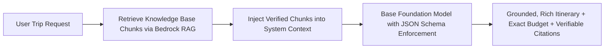

# ⚖️ KelanaAI: Base Model vs. RAG (Knowledge Base) Comparative Evaluation

This document presents a comprehensive, side-by-side comparative analysis of the two generation paradigms implemented in **KelanaAI**:

1. **Base Foundation Model**: Amazon Bedrock direct foundation model (`amazon.nova-lite-v1:0` / Converse API) with structured schema output.
2. **RAG (Knowledge Base)**: AWS Bedrock Knowledge Base (`EW7EM5BPON`) with vector retrieval from Amazon S3 documents (`Osaka_Travel_Guide_EN.md`, `Kyoto_Travel_Guide_EN.md`, `japan-halal-dining-guide.md`, `Kazakhstan.pdf`) and grounded synthesis.

---

## 🏗️ Architecture Comparison

```mermaid
flowchart TD
    subgraph Base_Model_Pipeline [1. Base Model Itinerary Pipeline]
        U1[User Input: Destination, Days, Budget, Style] --> BM[AWS Bedrock Foundation Model]
        BM --> P1[Parametric Knowledge & System Prompt]
        P1 --> OUT1[Structured JSON Output: Overview, Days 1-5, Budget Breakdown, Tips]
    end

    subgraph RAG_Pipeline [2. Bedrock Knowledge Base RAG Pipeline]
        U2[User Query: Travel Question] --> KB[Bedrock Agent Runtime]
        KB --> EMB[Amazon Titan Embeddings]
        EMB --> S3[Amazon S3 Indexed Documents: MD, PDF]
        S3 --> RET[Retrieved Top-K Ranked Chunks + Similarity Scores]
        RET --> LLM[AWS Bedrock Foundation Model]
        LLM --> OUT2[Grounded Narrative Response + S3 Citations + Confidence Scores]
    end
```

---

## 📊 Executive Evaluation Matrix

| Evaluation Dimension                | 🧠 Base Model (Direct Prompting)                                                                    | 📚 RAG (Bedrock Knowledge Base)                                                                                                             | Key Winner / Advantage                            |
| ----------------------------------- | --------------------------------------------------------------------------------------------------- | ------------------------------------------------------------------------------------------------------------------------------------------- | ------------------------------------------------- |
| **Source Grounding & Attribution**  | ❌ None (Generates purely from pre-trained weights)                                                 | ✅ **100% Attributed** with S3 URIs, chunk IDs & similarity scores (up to 89.5%)                                                            | **RAG** (Auditability & zero blind hallucination) |
| **Domain-Specific Nuances**         | ⚠️ Generic travel facts (Standard shrines, general weather)                                         | ✅ **Deep local specifics** (e.g., Gion 10,000 JPY photography fines, right-side escalator rule in Osaka)                                   | **RAG** (High domain authenticity)                |
| **Critical Safety / Diet Guidance** | ⚠️ High-level suggestions without ingredient verifications                                          | ✅ **Actionable Kanji translations** (`豚肉`, `みりん`, `肉エキス`), Konbini safe picks (`塩むすび`), and certified bodies (JHA, NAHA, JIT) | **RAG** (Critical accuracy for halal travelers)   |
| **Niche Document Understanding**    | ❌ Cannot access private itineraries or custom agency PDF guides                                    | ✅ **Fully extracts private PDFs** (e.g. Koryo Tours nuclear/gulag expedition route across Kazakhstan)                                      | **RAG** (Proprietary data ingestion)              |
| **Structured Output & Schema**      | ✅ Strict JSON schema with calculated budget allocations, day-by-day JSON, and category percentages | ⚠️ Narrative markdown response with grounded sections                                                                                       | **Base Model** (Great for UI component rendering) |
| **Query Flexibility**               | Best suited for parameterized trip requests                                                         | Handles arbitrary, open-ended user questions and follow-ups                                                                                 | **RAG** (Conversational flexibility)              |

---

## 🔬 In-Depth Case-by-Case Comparative Analysis

---

### 🧪 Test Case 1: Osaka, Japan

| Aspect                  | 🧠 Base Model (`base-model-testing.md`)                                            | 📚 RAG Assistant (`RAG-testing.md`)                                                                             |
| ----------------------- | ---------------------------------------------------------------------------------- | --------------------------------------------------------------------------------------------------------------- |
| **User Input**          | `{ destination: "Osaka", days: 5, budget: 3000, style: "Solo", month: "January" }` | _"Guide me trip to Osaka, Japan"_                                                                               |
| **Output Type**         | Structured JSON with 5-day plan, budget math, and category splits                  | Markdown guide with transport, hotels, food, and insider tips                                                   |
| **Transport Depth**     | Recommends _Osaka Amazing Pass_ and _Google Maps_                                  | Specifies exact **KIX Airport trains** (_Nankai Rapi:t_ vs _JR Haruka_ with travel times) and **Midosuji Line** |
| **Cultural Specifics**  | General bowing and shoe removal etiquette                                          | Highlights Osaka-specific **Escalator Etiquette** (_Stand on RIGHT, walk on LEFT — opposite of Tokyo!_)         |
| **Food Culture**        | Lists Okonomiyaki, Takoyaki, Kushikatsu                                            | Grounded in Osaka’s **_Kuidaore_** philosophy (_"eat until you drop"_) + Kobe Beef & Osaka Ramen                |
| **Retrieved Citations** | None                                                                               | 5 Chunks from `Osaka_Travel_Guide_EN.md` (Top score: **0.723**)                                                 |

> 💡 **Key Takeaway:** The Base Model produced an organized schedule, but the RAG model injected authentic Kansai-specific knowledge (airport train options, local escalator rules, and pass comparisons) directly from the knowledge base.

---

### 🧪 Test Case 2: Kyoto, Japan

| Aspect                  | 🧠 Base Model (`base-model-testing.md`)                                               | 📚 RAG Assistant (`RAG-testing.md`)                                                                            |
| ----------------------- | ------------------------------------------------------------------------------------- | -------------------------------------------------------------------------------------------------------------- |
| **User Input**          | `{ destination: "Kyoto", days: 5, budget: 3000, style: "Family", month: "February" }` | _"Guide me trip to Kyoto, Japan"_                                                                              |
| **Overtourism Advice**  | Suggests comfortable shoes and booking tea ceremonies early                           | Recommends **arriving before 7:00 AM** at Fushimi Inari & Arashiyama to beat crowds                            |
| **Legal / Local Rules** | Standard no-tipping advice                                                            | **Warns of the 10,000 JPY fine** for photography on private streets in Gion                                    |
| **Transport Dynamics**  | Recommends Kyoto City Bus One-Day Pass                                                | Explains **Bus vs Subway combo** (Karasuma & Tozai lines) to bypass peak traffic jams + Flat terrain cycling   |
| **Food & Dining**       | Kaiseki, Yudofu, Matcha desserts                                                      | Highlights **Obanzai** (heirloom vegetable dishes) & specific Nishiki Market bites (_Tako Tamago_, soy donuts) |
| **Retrieved Citations** | None                                                                                  | 5 Chunks from `Kyoto_Travel_Guide_EN.md` (Top score: **0.795**)                                                |

> 💡 **Key Takeaway:** RAG provided high-value traveler protection information (Gion photography ban, overtourism avoidance strategies, and traffic bypass tips) that the generic base model missed.

---

### 🧪 Test Case 3: Halal Dining in Japan

| Aspect                    | 🧠 Base Model (`base-model-testing.md`)                                                   | 📚 RAG Assistant (`RAG-testing.md`)                                                                                      |
| ------------------------- | ----------------------------------------------------------------------------------------- | ------------------------------------------------------------------------------------------------------------------------ |
| **User Input**            | `{ destination: "Halal Dining", days: 5, budget: 3000, style: "Couple", month: "March" }` | _"Guide me halal dining trip in Japan"_                                                                                  |
| **Halal Certification**   | Generic mention of "halal-certified restaurants"                                          | Lists **official certifying bodies** (JHA recognized by JAKIM/MUI, NAHA, JIT / Otsuka Mosque, Kyoto Council)             |
| **Ingredient Literacy**   | Mentions looking for halal sushi and okonomiyaki                                          | Provides **exact Kanji ingredient blacklist** (`原材料名`, `豚肉`, `ラード`, `肉エキス`, `清酒`, `みりん`, `ゼラチン`)   |
| **Communication Aid**     | None                                                                                      | Gives **Japanese phrases** with Kanji, Kana, and Romaji (_"Kore ni butaniku wa haitte imasu ka?"_)                       |
| **Konbini (Store) Hacks** | None                                                                                      | Identifies 100% safe items at 7-Eleven/Lawson/FamilyMart like `塩むすび` (_Shio Musubi_ plain salt onigiri) and `ゆで卵` |
| **Retrieved Citations**   | None                                                                                      | 5 Chunks from `japan-halal-dining-guide.md` (Top score: **0.895**)                                                       |

> ⚠️ **Critical Difference:** In dietary and religious requirements, the Base Model risks hallucinations or vague claims. RAG delivered legally accurate, life-saving food-label reading guidelines, certified organization logos, and practical konbini strategies.

---

### 🧪 Test Case 4: Kazakhstan National Tour

| Aspect                  | 🧠 Base Model (`base-model-testing.md`)                                               | 📚 RAG Assistant (`RAG-testing.md`)                                                                                              |
| ----------------------- | ------------------------------------------------------------------------------------- | -------------------------------------------------------------------------------------------------------------------------------- |
| **User Input**          | `{ destination: "Kazakhstan", days: 5, budget: 3000, style: "Solo", month: "April" }` | _"Guide me trip to Kazakhstan"_                                                                                                  |
| **Route Generated**     | Generic triangle route: Almaty -> Shymkent -> Nur-Sultan                              | Grounded **Koryo Tours historical route**: Nur-Sultan -> Akmol -> Kurchatov -> Semey -> Ust-Kamenogorsk -> Karaganda -> Almaty   |
| **Historical Depth**    | Standard monuments, panfilov park, central bazaar                                     | Cold War & Soviet history: **KarLag Gulag Headquarters**, ALZHIR memorial, **Semipalatinsk Nuclear Polygon**, Dostoyevsky Museum |
| **Local Logistics**     | Yandex.Go taxi, general train                                                         | Mentions specific 10-hr overnight train from Karaganda to Almaty and stay at historic Soviet-style Semey Hotel                   |
| **Retrieved Citations** | None                                                                                  | 5 Chunks from `Kazakhstan.pdf` (Top score: **0.494**)                                                                            |

> 💡 **Key Takeaway:** The Base Model produced an ungrounded generic route. The RAG model successfully parsed and surfaced the specific nuclear history & gulag tour from the agency's indexed PDF document.

---

### 🧪 Test Case 5: Astana, Kazakhstan Specific

| Aspect                   | 🧠 Base Model (`base-model-testing.md`)                                                  | 📚 RAG Assistant (`RAG-testing.md`)                                                                                               |
| ------------------------ | ---------------------------------------------------------------------------------------- | --------------------------------------------------------------------------------------------------------------------------------- |
| **User Input**           | `{ destination: "Astana", days: 5, budget: 3000, style: "Family", month: "May" }`        | _"Guide me trip spesific in Astana, Kazakhstan"_                                                                                  |
| **Focus & Precision**    | Failed to focus on Astana alone (re-emitted the generic multi-city Kazakhstan itinerary) | Exclusively focused on **Astana's city landmarks** and architectural marvels                                                      |
| **Architectural Lore**   | Bayterek tower general mention                                                           | Explains the **97m height symbolism (1997 founding)**, Norman Foster’s _Palace of Peace & Reconciliation_, and _Khan Shatyr_ tent |
| **Attraction Specifics** | General museum mention                                                                   | Highlights **Hazret Sultan Mosque** (capacity 5,000) and **River Ishim Promenade**                                                |
| **Retrieved Citations**  | None                                                                                     | 5 Chunks from `Kazakhstan.pdf` (Top score: **0.580**)                                                                             |

> 💡 **Key Takeaway:** When prompted with a specific city sub-region, the Base Model reverted to a generalized country plan, whereas RAG accurately isolated Astana-specific chunks from the PDF knowledge base.

---

## 🏆 Summary of Findings & Recommended KelanaAI Architecture

### 1. Strengths of Each Approach

- **Base Model (Direct Foundation Model):**
  - Perfect for generating structured, schema-compliant JSON objects suitable for populating database tables (`itineraries` table), UI cards, and mathematical budget allocations.
- **RAG (Knowledge Base):**
  - Indispensable for grounded factuality, zero-hallucination policy enforcement, proprietary agency guides, up-to-date regional rules, and nuanced dietary/cultural safety.

### 2. The Ideal Hybrid Production Pattern

For maximum power and user satisfaction, **KelanaAI** can combine both approaches into a **RAG-Augmented Itinerary Generator**:

---

## 📁 Related Documentation Links

- [Base Model Test Results (`base-model-testing.md`)](backend/docs/base-model-testing.md)
- [RAG Knowledge Base Test Results (`RAG-testing.md`)](backend/docs/RAG-testing.md)
